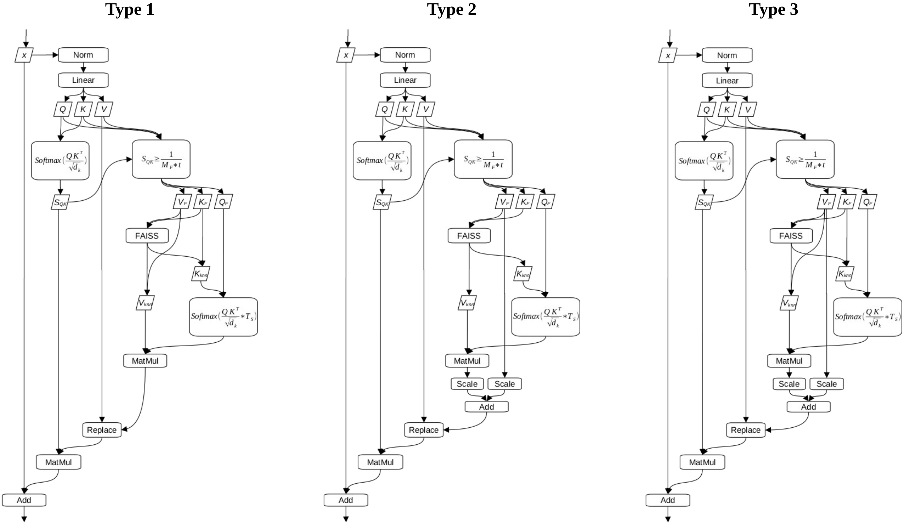

## Towards Integrating Medium-Term Memory into Transformer Models:

## Directing Sentiment and Evoking Recall in GPT-2 from an Attention Bock Based Persistent Memory using a Small Fraction of One Layer and a Case for the Spacial Separation of what might be described as Emotional Implicit Memory and Explicit Memory

 This work proposes a bolt on method which uses a *k*-nearest neighbours algorithm to search a persistent memory while reusing the internal machinery of the Transformers’ attention blocks to determine what to search for and how to rank the search results. It was found that sentiment direction through what might be described as emotional implicit memory and recall (explicit memory) appear to arise from different layers in GPT-2 (layers 7, 8 and 9 vs. layer 10 respectively). For sentiment direction, it was found that with a positive persistent memory it required a fraction of layers (< 3) and a fraction of each layers’ tokens-heads (< 10%) to change the VADER compound score from a median of -0.13 with an IQR of 1.6 in unadulterated GPT-2 to a median of 0.99 with an IQR of 0.01 with the method. For recall, it was found that the method pulls similar tokens out of the persistent memory as GPT-2 appears to “look” at in the context. Further, it was found that only a fraction of the first context tokens’ tokens-heads in a single layer (5 out of 2160 total tokens-heads) was sufficient to produce similar or better recall results in most cases than when the Wikipedia text was placed in the context. This suggests that the computational cost of recall using this method may be context length independent.



See the [paper](Towards_Integrating_Medium-Term_Memory_into_Transformer_Models.pdf) for more details.

### Install

```
pip install torch numpy transformers datasets tiktoken wandb tqdm faiss os shutil
```

Dependencies:

- [pytorch](https://pytorch.org)
- [numpy](https://numpy.org/install/)
-  `transformers` for huggingface transformers (to load GPT-2 checkpoints)
-  `datasets` for huggingface datasets (if you want to download + preprocess OpenWebText)
-  `tiktoken` for OpenAI's fast BPE code
-  `wandb` for optional logging
-  `tqdm` for progress bars
-  `faiss` (Facebook AI Similarity Search) for k-nearest neighbours search
-  `os` for loading and saving persistent memory
-  `shutil` for saving persistent memory

### Usage

This project was adapted from Andrej Karpathy's [nanoGPT](https://github.com/karpathy/nanoGPT) and as such works in a similar fashion. However, the code was adapted without a GPU, thus, it was not written for, has not been tested on and **will not work on a GPU**. To get it to work on a GPU, start with the FAISS section of the model (model.py line 280, [FAISS GPU documentation](https://github.com/facebookresearch/faiss/wiki/Faiss-on-the-GPU)).

Three templates have been included in this repository. One which demonstrates directing sentiment, one that demonstrates recall and one which produces text from the unadulterated version of GPT-2. To explore changing the various parameters of the methods or change the persistent memory, edit/create new templates from the templates in the config directory.

### Sentiment Direction

This work takes a slightly different perspective on sentiment direction. Since it is an attempt to replicate emotional implicit memory, the perspective is more akin to the difference in a persons’ response to a mouse running across the diner table when they have one of the two below memories:

    1. “mice are disgusting vectors of disease”
    2. “mice are so cute especially when being fed”

 To trial a template for sentiment direction which uses the *Type 3 method* and has the same parameters as ***Table 1*** in the [paper](Towards_Integrating_Medium-Term_Memory_into_Transformer_Models.pdf) use the below:

```
$ python sample.py config/sample_gpt2_type_3_method.py 
```

### Recall

GPT-2 is not the ideal model to test recall. To get around this a Wikipedia paragraph and contrived question were chosen such that GPT-2 got the expected answer 50 out of 100 tries/seeds when the Wikipedia paragraph was placed in the context prior the the contrived question. 

To trial the template that places the Wikipedia paragraph in the persistent memory and the question in the context and uses the *Type 2 method* with the same parameters as ***Table 4*** in the [paper](Towards_Integrating_Medium-Term_Memory_into_Transformer_Models.pdf) use the below.

```
$ python sample.py config/sample_gpt2_type_2_method.py 
```

### GPT-2

The template to generate text through unadulterated GPT-2 is below:

```
$ python sample.py config/sample_gpt2.py 
```

### Using More Capable Models

It is difficult to determine from GPT-2 if this will be an effective method. If someone is curious enough to try this out on a more capable model I would be incredibly interested to learn how it worked out. Perhaps leave a note in issues.

### Acknowledgements

Andrej Karpathy for generously releasing the [nanoGPT](https://github.com/karpathy/nanoGPT) repository under the MIT license.

### arXiv Endorsement

Tried twice:

February 26 2024: Emailed the [paper](Towards_Integrating_Medium-Term_Memory_into_Transformer_Models.pdf) to David Bau of North Eastern University and was ignored.

February 28 2024: Emailed the [paper](Towards_Integrating_Medium-Term_Memory_into_Transformer_Models.pdf) to Matthew R. Gormley of Carnegie Mellon University. Initially said he would endorse it but then did not. This may have been due to him emailing a person I have not talked to in years but who is the type of person who would bad talk behind my back for reasons he has not shared with me.

This is just something I started playing with after becoming curious about transformers and thought others might be interested. If someone wants it on arXiv and can endorse it leave me a note.
